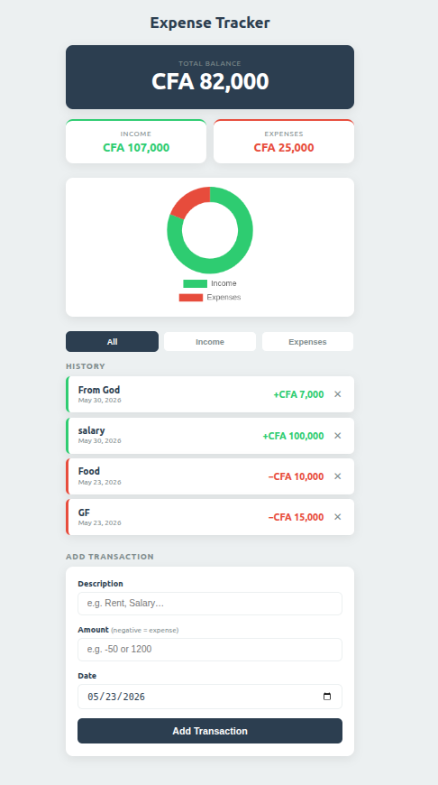

# 💰 Expense Tracker

A clean, lightweight personal finance tracker that runs entirely in the browser — no installation, no backend, no sign-up required. Track your income and expenses in CFA francs, visualize your spending with a live doughnut chart, and keep a filtered transaction history — all data persisted locally in your browser.

---

## 📸 Preview

<p align="center">
  
</p>

---

## ✨ Features

| Feature | Description |
|---|---|
| 📊 **Live Doughnut Chart** | Visual breakdown of income vs. expenses powered by Chart.js |
| 💼 **Balance Summary** | Instant total balance with separate income & expense totals |
| 🔍 **Transaction Filters** | Filter history by All / Income / Expenses |
| ➕ **Add Transactions** | Log income (positive amount) or expenses (negative amount) with a date |
| 🗑️ **Delete Transactions** | Remove any entry with a single click |
| 💾 **LocalStorage Persistence** | All data survives page refreshes — stored securely in the browser |
| 📱 **Responsive Design** | Fully optimised for mobile and desktop screens |
| 🔒 **XSS-Safe Rendering** | All user input is HTML-escaped before display |

---

## 🛠️ Tech Stack

| Layer | Technology |
|---|---|
| Structure | HTML5 (Semantic markup) |
| Styling | Vanilla CSS3 (Custom Properties, Flexbox) |
| Logic | Vanilla JavaScript (ES6+) |
| Chart | [Chart.js](https://www.chartjs.org/) v4 (CDN) |
| Persistence | Browser `localStorage` |

> **Zero dependencies to install.** Chart.js is loaded via CDN — no `npm install` needed.

---

## 📁 Project Structure

```
expense_T/
├── index.html        # App markup & layout
├── style.css         # All styles (CSS custom properties, responsive)
├── script.js         # App logic (CRUD, filtering, chart, persistence)
├── assets/
│   └── app-preview.png   # App screenshot
└── README.md         # Project documentation
```

---

## 🚀 Getting Started

### Option 1 — Open directly (simplest)

1. Clone or download this repository:
   ```bash
   git clone https://github.com/your-username/expense_T.git
   ```
2. Open `index.html` in any modern browser:
   ```bash
   cd expense_T
   open index.html        # macOS
   xdg-open index.html    # Linux
   start index.html       # Windows
   ```

That's it — no build step, no server, no dependencies to install.

---

### Option 2 — Serve locally (recommended for development)

If you have Python installed:
```bash
# Python 3
python3 -m http.server 5500
```
Then visit `http://localhost:5500` in your browser.

Or with the VS Code **Live Server** extension — right-click `index.html` → *Open with Live Server*.

---

## 📖 How to Use

### Adding a Transaction
1. Scroll to the **Add Transaction** section at the bottom.
2. Enter a **Description** (e.g., `Salary`, `Food`, `Rent`).
3. Enter the **Amount**:
   - Positive number → **Income** (e.g., `100000` for a CFA 100,000 salary)
   - Negative number → **Expense** (e.g., `-15000` for a CFA 15,000 purchase)
4. Select a **Date** (defaults to today).
5. Click **Add Transaction**.

### Deleting a Transaction
- Click the **✕** button on the right side of any transaction row.

### Filtering Transactions
- Use the **All / Income / Expenses** tab buttons above the history list to filter your view.

### Reading the Chart
- The doughnut chart updates in real time showing the **proportion of income (green) vs. expenses (red)**.
- The chart is hidden when no transactions exist.

---

## 💡 Currency

This app uses **CFA Franc (XOF/XAF)** as its currency. Amounts are formatted as whole integers (no decimals) with thousands separators — e.g., **CFA 107,000**.

To change the currency symbol, update the `formatCurrency` function in `script.js`:

```js
// script.js — line ~144
function formatCurrency(value) {
  return 'CFA ' + Math.abs(value).toFixed(0).replace(/\B(?=(\d{3})+(?!\d))/g, ',');
  //      ^^^^ Change 'CFA' to your preferred symbol (e.g., '$', '€', '₦')
}
```

---

## 🗂️ Data Storage

All transactions are persisted in the browser's `localStorage` under the key `"transactions"`. Data is:
- ✅ Preserved on page refresh
- ✅ Isolated per browser / device
- ❌ Not synced across devices (no backend)

To clear all data manually, open the browser **DevTools → Application → Local Storage** and delete the `transactions` key.

---

## 📐 Responsive Breakpoints

| Breakpoint | Behaviour |
|---|---|
| `> 480px` | Centred single-column layout, max 480 px wide |
| `≤ 400px` | Summary cards stack vertically; balance font scales down |

---

## 🧩 Customisation

### Colours
All colours are defined as CSS custom properties in `style.css`:

```css
:root {
  --green: #2ecc71;   /* Income colour */
  --red:   #e74c3c;   /* Expense colour */
  --dark:  #2c3e50;   /* Primary dark / balance card */
  --light: #ecf0f1;   /* Page background */
}
```

### Chart Style
The chart is a **doughnut** type with a 65% cutout. To change to a pie chart, edit `script.js`:

```js
type: 'doughnut',  // Change to 'pie' if preferred
```

---

## 🔮 Potential Future Improvements

- [ ] Multi-currency support with auto-conversion
- [ ] Category tags per transaction (Food, Transport, Housing…)
- [ ] Monthly/weekly spending reports
- [ ] CSV export of transaction history
- [ ] PWA support (offline-first, installable on mobile)
- [ ] Cloud sync via a lightweight backend or Firebase

---

## 📄 License

This project is open source and available under the [MIT License](./LICENSE).

---

## 🙋‍♂️ Author

Built by **Roger** — a minimal, no-fluff personal finance tracker for everyday use.

---

<p align="center">
  Made with ❤️ and Vanilla JS
</p>
